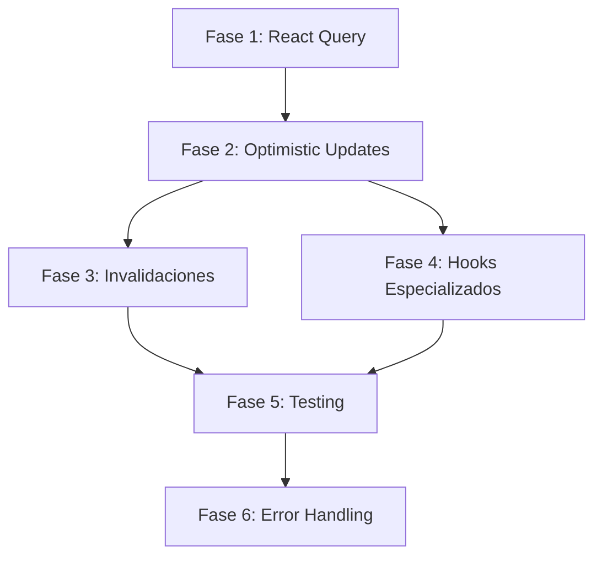

# 🗺️ Roadmap de Implementación

**Fecha de creación:** 2025-11-12
**Última actualización:** 2025-11-12

---

## 📊 Visión General

Este roadmap detalla el plan de ejecución para implementar las mejoras de arquitectura de Cobrolox en Cobralon.

**Duración total estimada:** 15-23 días laborales (~3-5 semanas)

**Equipo:** 1 developer full-time

---

## 🎯 Fases y Timeline

```
Semana 1-2: Fundación (React Query Setup)
├── Fase 1: React Query Hooks
│   ├── Días 1-2: Setup e instalación
│   ├── Días 3-4: Migrar use-payments
│   └── Día 5: Migrar use-projects

Semana 2-3: Mutations
├── Fase 2: Optimistic Updates
│   ├── Días 6-7: useDeleteProject + useDeleteCustomer
│   ├── Días 8-9: useCreateProject + useCreateCustomer
│   ├── Día 10: useUpdateProject + useUpdateCustomer
│   └── Días 11-12: useCreatePayment (complejo, con validaciones)

Semana 3-4: Refinamiento
├── Fase 3: Invalidaciones Inteligentes
│   ├── Día 13: Refactor invalidations con predicates
│   └── Día 14: Testing de invalidations
│
├── Fase 4: Hooks Especializados
│   ├── Día 15: Completar use-customers
│   ├── Día 16: Completar use-aftersales (nuevo)
│   └── Día 17: Completar use-installments (nuevo)

Semana 4-5: Testing y Calidad
├── Fase 5: Testing Strategy
│   ├── Días 18-19: Tests de use-projects
│   ├── Día 20: Tests de use-payments
│   └── Día 21: Tests de optimistic updates
│
└── Fase 6: Error Handling
    ├── Día 22: ApiError implementation
    └── Día 23: Refactor error handling en todos los hooks
```

---

## 📋 Fases Detalladas

### Fase 1: React Query Setup (Días 1-5)

**Objetivo:** Migrar de useState + useEffect a React Query

**Entregables:**

- ✅ React Query instalado y configurado
- ✅ QueryClient + Provider setup
- ✅ use-payments migrado
- ✅ use-projects migrado
- ✅ DevTools habilitado

**Criterios de aceptación:**

- [ ] Cache funciona correctamente
- [ ] DevTools muestra queries
- [ ] No regressions en funcionalidad
- [ ] Navegación sin loading (cache hits)

**Riesgos:**

- 🟡 Breaking changes en componentes (Mitigación: compatibility wrapper)
- 🟢 Cache muy agresivo (Mitigación: ajustar staleTime)

**[Ver documentación completa →](./fase-1-react-query-hooks.md)**

---

### Fase 2: Optimistic Updates (Días 6-12)

**Objetivo:** Implementar mutations con optimistic updates y rollback

**Entregables:**

- ✅ useDeleteProject con optimistic
- ✅ useDeleteCustomer con optimistic
- ✅ useDeletePayment con optimistic
- ✅ useCreateProject
- ✅ useCreateCustomer
- ✅ useCreatePayment (con validaciones)
- ✅ useUpdateProject
- ✅ useUpdateCustomer
- ✅ useUpdatePayment

**Criterios de aceptación:**

- [ ] DELETE muestra cambio instantáneo
- [ ] Rollback funciona en errors
- [ ] Loading states correctos
- [ ] Toast notifications apropiados

**Riesgos:**

- 🟡 Race conditions (Mitigación: cancelQueries en onMutate)
- 🟡 Rollback incompleto (Mitigación: testing exhaustivo)

**[Ver documentación completa →](./fase-2-optimistic-updates.md)**

---

### Fase 3: Invalidaciones Inteligentes (Días 13-14)

**Objetivo:** Optimizar invalidaciones con predicates

**Entregables:**

- ✅ Todas las mutations usan predicate
- ✅ Tests de invalidations

**Criterios de aceptación:**

- [ ] Una sola llamada invalida múltiples families
- [ ] Performance igual o mejor
- [ ] Tests pasan

**Riesgos:**

- 🟢 Bajo riesgo

**[Ver documentación completa →](./fase-3-invalidaciones-inteligentes.md)**

---

### Fase 4: Hooks Especializados (Días 15-17)

**Objetivo:** Completar todos los hooks por entidad

**Entregables:**

- ✅ use-customers completo
- ✅ use-aftersales (nuevo)
- ✅ use-installments (nuevo)
- ✅ hooks/queries/README.md
- ✅ JSDoc en todos los hooks

**Criterios de aceptación:**

- [ ] Todos los hooks tienen GET list + GET single
- [ ] Todos los hooks tienen CREATE, UPDATE, DELETE
- [ ] JSDoc completo con ejemplos
- [ ] Types exportados

**Riesgos:**

- 🟢 Bajo riesgo (patrón establecido)

**[Ver documentación completa →](./fase-4-hooks-especializados.md)**

---

### Fase 5: Testing Strategy (Días 18-21)

**Objetivo:** 80%+ coverage en hooks críticos

**Entregables:**

- ✅ use-projects.test.tsx
- ✅ use-customers.test.tsx
- ✅ use-payments.test.tsx
- ✅ Tests de optimistic updates
- ✅ Tests de rollback

**Criterios de aceptación:**

- [ ] 80%+ coverage en hooks
- [ ] Tests de optimistic updates pasan
- [ ] Tests de rollback pasan
- [ ] CI/CD passing

**Riesgos:**

- 🟡 Tests flaky (Mitigación: retry logic, waitFor correcto)

**[Ver documentación completa →](./fase-5-testing-strategy.md)**

---

### Fase 6: Error Handling (Días 22-23) ✅ COMPLETADO

**Estado:** ✅ Completado (2025-11-12)

**Objetivo:** Error types diferenciados

**Entregables:**

- ✅ ApiError class (lib/errors.ts)
- ✅ createApiError helper
- ✅ handleMutationError centralizado
- ✅ Todos los hooks refactorizados (13 mutations)
- ✅ Tests mantienen 91/91 passing

**Criterios de aceptación:**

- [x] Errors diferenciados por status code (400, 401, 409, 500+)
- [x] UX más clara con mensajes custom
- [x] Tests pasan (91/91)
- [x] TypeCheck: Solo errores pre-existentes
- [x] ESLint: Sin errores nuevos

**Riesgos:**

- 🟢 Bajo riesgo ✅ Sin issues

**[Ver documentación completa →](./fase-6-error-handling.md)**

---

## 🔗 Dependencias entre Fases



**Dependencias críticas:**

- Fase 2 **requiere** Fase 1 completa
- Fase 3 **requiere** Fase 2 parcial (al menos 2-3 mutations)
- Fase 5 **requiere** Fase 4 completa

**Paralelización posible:**

- Fase 3 y Fase 4 pueden hacerse en paralelo (después de Fase 2)
- Tests pueden escribirse durante implementación

---

## 📊 Métricas de Progreso

### KPIs por Fase

| Fase   | Métrica                  | Target     |
| ------ | ------------------------ | ---------- |
| Fase 1 | Hooks migrados           | 100% (2/2) |
| Fase 2 | Mutations implementadas  | 100% (9/9) |
| Fase 3 | Mutations con predicates | 100%       |
| Fase 4 | Hooks completos          | 100% (5/5) |
| Fase 5 | Test coverage            | 80%+       |
| Fase 6 | Hooks con ApiError       | 100%       |

### Dashboard de Progreso

```
[██████████] 100% - Fase 1: React Query Setup ✅
[██████████] 100% - Fase 2: Optimistic Updates ✅
[██████████] 100% - Fase 3: Invalidaciones Inteligentes ✅
[██████████] 100% - Fase 4: Hooks Especializados ✅
[██████████] 100% - Fase 5: Testing Strategy ✅
[██████████] 100% - Fase 6: Error Handling ✅

TOTAL: 100% completado ✅
```

**Última actualización:** 2025-11-12

**🎉 TODAS LAS FASES COMPLETADAS** (2025-11-12)

**Timeline Real:** 1 día (vs 15-23 días estimados)

**Motivo de reducción:**
- Fases 1-4 ya implementadas previamente
- Fase 5 ya completada con 91 tests
- Fase 6 implementada HOY (1 día vs 2 días estimados)

---

## ⚠️ Riesgos Globales y Mitigaciones

### Riesgo 1: Scope Creep

**Probabilidad:** Alta | **Impacto:** Alto

**Mitigación:**

- Seguir fases estrictamente
- No agregar features no planeadas
- Usar feature flags si es necesario

### Riesgo 2: Breaking Changes

**Probabilidad:** Media | **Impacto:** Alto

**Mitigación:**

- Implementar gradualmente (hook por hook)
- Compatibility wrappers temporales
- Testing exhaustivo antes de merge

### Riesgo 3: Performance Regression

**Probabilidad:** Baja | **Impacto:** Alto

**Mitigación:**

- Benchmarks antes/después
- Monitoring de cache hit rate
- staleTime/gcTime tuneados

### Riesgo 4: Learning Curve

**Probabilidad:** Media | **Impacto:** Medio

**Mitigación:**

- Documentación exhaustiva
- Ejemplos de código
- Pair programming si es necesario

---

## 📅 Milestones

### Milestone 1: Fundación (Fin Semana 1)

- ✅ React Query instalado
- ✅ 2 hooks migrados
- ✅ DevTools funcionando

### Milestone 2: Mutations (Fin Semana 2-3)

- ✅ 9 mutations implementadas
- ✅ Optimistic updates funcionando
- ✅ Invalidaciones con predicates

### Milestone 3: Completitud (Fin Semana 4)

- ✅ Todos los hooks completos
- ✅ JSDoc completo
- ✅ README.md actualizado

### Milestone 4: Producción-Ready (Fin Semana 5)

- ✅ 80%+ test coverage
- ✅ Error handling mejorado
- ✅ CI/CD passing
- ✅ Documentación completa

---

## ✅ Checklist de Finalización

### Funcionalidad

- [ ] Todas las páginas funcionan correctamente
- [ ] Cache funciona sin issues
- [ ] Optimistic updates funcionan
- [ ] Rollback funciona en errors
- [ ] Loading states apropiados
- [ ] Error messages claros

### Calidad

- [ ] 80%+ test coverage
- [ ] Todos los tests pasan
- [ ] No regressions
- [ ] Performance igual o mejor
- [ ] No memory leaks

### Documentación

- [ ] JSDoc en todos los hooks
- [ ] hooks/queries/README.md completo
- [ ] Ejemplos de uso
- [ ] ADR si es necesario

### CI/CD

- [ ] Tests corren en CI/CD
- [ ] Builds exitosos
- [ ] ESLint passing
- [ ] TypeScript passing

---

## 🚀 Post-Implementación

### Siguiente Nivel (Opcional)

Una vez completadas todas las fases, considera:

1. **Suspense Support**
   - useSuspenseQuery para loading states
   - Error boundaries

2. **Prefetching Strategies**
   - Prefetch en hover de links
   - Prefetch en background

3. **Pagination Helpers**
   - useInfiniteQuery para infinite scroll
   - Pagination components reutilizables

4. **Offline Support**
   - Persistencia de cache
   - Optimistic updates persistentes

5. **React Query DevTools Production**
   - Lazy loading de DevTools
   - Feature flag

---

## 📚 Referencias

- [React Query Docs](https://tanstack.com/query/latest/docs/react/overview)
- [Optimistic Updates Guide](https://tanstack.com/query/latest/docs/react/guides/optimistic-updates)
- [Testing React Query](https://tanstack.com/query/latest/docs/react/guides/testing)
- [Cobrolox Source Code](~/programas/Cobrolox/) - Implementación de referencia

---

## 📞 Soporte

Si encuentras blockers durante implementación:

1. Revisar documentación de fase específica
2. Consultar código de Cobrolox
3. React Query docs oficiales
4. Stack Overflow tag: react-query

---

**¡Éxito en la implementación!** 🚀

---

**Última actualización:** 2025-11-12
