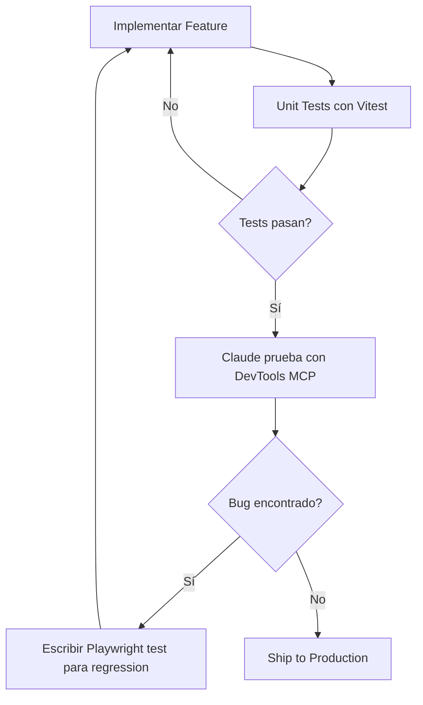

# Chrome DevTools MCP - Testing E2E Experimental

Guía para usar Chrome DevTools MCP como herramienta experimental de testing E2E con Claude Code.

## ¿Qué es Chrome DevTools MCP?

Chrome DevTools MCP es un servidor MCP (Model Context Protocol) que permite a Claude Code controlar un navegador Chrome a través del protocolo DevTools. Esto posibilita:

- Control programático del navegador
- Inspección de elementos y DOM
- Captura de screenshots
- Análisis de performance y network
- Ejecución de JavaScript en el contexto de la página

## Instalación

### 1. Instalar el servidor MCP

```bash
npm install -g @modelcontextprotocol/server-chrome-devtools
```

### 2. Configurar Claude Code

Agregar al archivo de configuración de Claude Code (`~/.config/Claude Code/mcp_settings.json`):

```json
{
  "mcpServers": {
    "chrome-devtools": {
      "command": "npx",
      "args": ["@modelcontextprotocol/server-chrome-devtools"],
      "env": {
        "CHROME_PATH": "/usr/bin/google-chrome"
      }
    }
  }
}
```

### 3. Iniciar Chrome en modo debugging

```bash
# Linux / macOS
google-chrome --remote-debugging-port=9222

# Windows
"C:\\Program Files\\Google\\Chrome\\Application\\chrome.exe" --remote-debugging-port=9222
```

## Herramientas Disponibles

### Navegación

- `navigate_page(url)` - Navegar a una URL
- `navigate_page_history("back" | "forward")` - Navegar historial
- `list_pages()` - Listar todas las pestañas abiertas
- `select_page(pageIdx)` - Seleccionar una pestaña
- `new_page(url)` - Abrir nueva pestaña
- `close_page(pageIdx)` - Cerrar pestaña

### Inspección

- `take_snapshot()` - Capturar snapshot textual del DOM
- `take_screenshot()` - Capturar screenshot visual
- `evaluate_script(function, args)` - Ejecutar JavaScript

### Interacción

- `click(uid)` - Hacer click en elemento
- `fill(uid, value)` - Llenar input/select
- `fill_form(elements)` - Llenar formulario completo
- `hover(uid)` - Hover sobre elemento
- `drag(from_uid, to_uid)` - Drag and drop

### Debugging

- `list_console_messages()` - Leer logs de consola
- `list_network_requests()` - Ver peticiones HTTP
- `get_network_request(url)` - Detalles de una petición específica
- `performance_start_trace()` - Iniciar tracing de performance
- `performance_stop_trace()` - Detener y analizar trace

### Utilidades

- `resize_page(width, height)` - Cambiar tamaño de viewport
- `emulate_cpu(throttlingRate)` - Simular CPU lenta
- `emulate_network("Slow 3G" | "Fast 3G")` - Simular network lenta
- `handle_dialog("accept" | "dismiss")` - Manejar alert/confirm
- `upload_file(uid, filePath)` - Subir archivo
- `wait_for(text)` - Esperar a que aparezca texto

## Casos de Uso

### 1. Testing de UI

```typescript
// Ejemplo conceptual (no código real)
// Claude ejecutaría esto a través de MCP tools

1. navigate_page("http://localhost:3000")
2. take_snapshot() // Verificar que el layout se renderizó
3. click("button-submit") // uid del elemento
4. wait_for("Success message")
5. take_screenshot() // Evidencia visual
```

### 2. Testing de Formularios

```typescript
1. navigate_page("http://localhost:3000/form")
2. fill_form([
     { uid: "input-name", value: "John" },
     { uid: "input-email", value: "john@example.com" },
     { uid: "select-country", value: "US" }
   ])
3. click("button-submit")
4. list_console_messages() // Verificar no hay errores
5. wait_for("Form submitted successfully")
```

### 3. Performance Testing

```typescript
1. navigate_page("http://localhost:3000")
2. performance_start_trace({ reload: true, autoStop: true })
3. performance_stop_trace() // Obtener Core Web Vitals
4. list_network_requests() // Analizar peticiones lentas
```

### 4. Mobile Testing

```typescript
1. resize_page(375, 667) // iPhone SE
2. navigate_page("http://localhost:3000")
3. take_screenshot() // Ver responsive design
4. emulate_cpu(4) // Simular CPU 4x más lenta
5. emulate_network("Slow 3G")
```

## Ventajas vs Otras Herramientas

### vs Playwright

**Ventajas de Chrome DevTools MCP:**

- ✅ Claude Code puede escribir y ejecutar tests conversacionalmente
- ✅ No requiere aprender API de Playwright
- ✅ Iteración más rápida (describe el problema → Claude lo prueba)
- ✅ Útil para debugging ad-hoc

**Desventajas:**

- ❌ No está diseñado para CI/CD
- ❌ Tests no son reproducibles (no hay archivos de test)
- ❌ No hay assertions automáticas
- ❌ Requiere Chrome ejecutándose en modo debug

### vs Cypress

Similar a comparación con Playwright:

- Chrome DevTools MCP es mejor para **exploración y debugging**
- Cypress es mejor para **regression testing automatizado**

### vs Manual Testing

**Ventajas:**

- ✅ Claude puede ejecutar escenarios complejos rápidamente
- ✅ Captura evidencia automáticamente (screenshots, logs)
- ✅ Puede repetir escenarios exactamente
- ✅ Analiza performance y network en paralelo

**Desventajas:**

- ❌ Requiere describir el escenario a Claude
- ❌ No tan intuitivo como navegar manualmente

## Limitaciones

### Técnicas

- **Solo Chrome/Chromium**: No funciona con Firefox o Safari
- **Debugging mode requerido**: Chrome debe correr con `--remote-debugging-port`
- **No multi-browser**: No prueba compatibilidad cross-browser
- **No parallel execution**: Una instancia de Chrome a la vez

### Workflow

- **No es para CI/CD**: No está diseñado para pipelines automatizados
- **Tests no persistentes**: No genera archivos `.spec.ts` reusables
- **Sin test runner**: No hay concepto de test suites o reporters

## Recomendaciones de Uso

### ✅ USAR para:

1. **Exploración de bugs reportados**
   - Usuario reporta: "El formulario no funciona"
   - Claude navega, llena el formulario, captura el error

2. **Validación rápida de features nuevas**
   - Acabas de implementar checkout
   - Pides a Claude que pruebe el flujo completo

3. **Testing de edge cases**
   - "Prueba qué pasa si lleno el formulario con emojis"
   - "Simula network lenta y ve si el loading spinner aparece"

4. **Performance debugging**
   - "Analiza por qué la página carga lenta"
   - Claude ejecuta trace y analiza bottlenecks

5. **Generación de screenshots**
   - "Captura screenshots de todas las páginas en mobile y desktop"

### ❌ NO USAR para:

1. **Regression testing**
   - Usa Playwright/Cypress para esto

2. **CI/CD pipelines**
   - Chrome DevTools MCP requiere interacción humana

3. **Cross-browser testing**
   - Solo funciona con Chrome

4. **Tests que necesitan persistir**
   - No genera archivos `.spec.ts`

## Integración con Otros Tools

### Vitest + Chrome DevTools MCP

- **Vitest** para unit/integration tests (fast, deterministic)
- **Chrome DevTools MCP** para E2E exploratory testing (manual, ad-hoc)

No son excluyentes, sino complementarios:

- Vitest valida lógica de negocio
- Chrome DevTools MCP valida flujos de usuario complejos

### Workflow Recomendado



## Ejemplos Reales

### Caso 1: Debugging de Formulario

**Usuario:** "El formulario de contacto no envía datos"

**Claude con DevTools MCP:**

1. Navega a `/contact`
2. Toma snapshot del DOM
3. Llena el formulario
4. Click en submit
5. Lista console errors → Encuentra `TypeError: Cannot read property 'value' of null`
6. Toma screenshot del error
7. Analiza el código y encuentra que falta validación de campo

**Resultado:** Bug identificado en 30 segundos vs 5 minutos manualmente

### Caso 2: Performance Audit

**Usuario:** "La página de productos carga lento"

**Claude con DevTools MCP:**

1. Navega a `/products`
2. Inicia performance trace con reload
3. Detiene trace y analiza:
   - LCP: 4.2s (malo)
   - Largest image: 3.5MB sin optimizar
   - 45 peticiones HTTP (muchas)
4. Lista network requests y encuentra:
   - Imágenes sin lazy loading
   - Bundle JS de 2MB
5. Genera reporte con recomendaciones

**Resultado:** Diagnóstico completo en 1 minuto

### Caso 3: Mobile Responsive

**Usuario:** "El sidebar se ve raro en iPhone"

**Claude con DevTools MCP:**

1. Resize a 375x667 (iPhone SE)
2. Navega a `/dashboard`
3. Toma screenshot → Sidebar se sale del viewport
4. Inspecciona CSS con evaluate_script
5. Encuentra que falta `overflow-x: hidden`
6. Toma screenshot del fix
7. Prueba en otros tamaños (iPad, Android)

**Resultado:** Bug de responsive identificado y documentado con screenshots

## Conclusión

Chrome DevTools MCP es una herramienta **experimental** útil para:

- Debugging interactivo con Claude
- Exploración rápida de issues
- Generación de evidencia (screenshots, logs)

**NO reemplaza** a Playwright/Cypress para regression testing automatizado.

**Úsalo como complemento**, no como reemplazo, de tu estrategia de testing tradicional.

---

## Referencias

- [Chrome DevTools Protocol](https://chromedevtools.github.io/devtools-protocol/)
- [Model Context Protocol](https://modelcontextprotocol.io/)
- [Chrome DevTools MCP Server](https://github.com/modelcontextprotocol/servers/tree/main/src/chrome-devtools)

---

**Última actualización:** 2025-01-13
