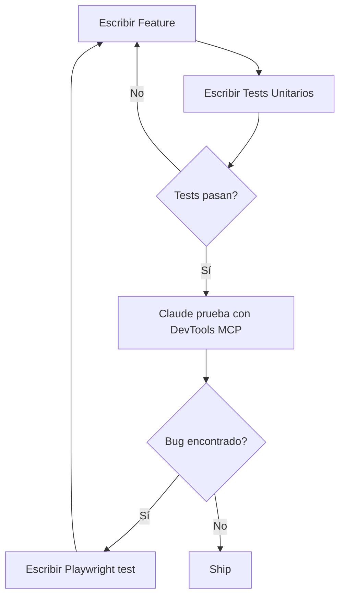

# Testing - Estrategia de Testing

Estrategia de testing implementada en este template.

## Stack de Testing

| Nivel                | Herramienta                           | Estado                       | Propósito                 |
| -------------------- | ------------------------------------- | ---------------------------- | ------------------------- |
| **Unit/Integration** | Vitest 3.2.4 + Testing Library 16.3.0 | ✅ Implementado              | Componentes, hooks, utils |
| **E2E Exploratory**  | Chrome DevTools MCP                   | 🔬 Experimental              | Debugging con Claude      |
| **E2E Regression**   | Playwright                            | 📋 Recomendado (no incluido) | CI/CD, cross-browser      |
| **Code Quality**     | ESLint 8 + Prettier                   | ✅ Implementado              | Linting y formatting      |

## Arquitectura de Testing

```
┌─────────────────────────────────────────┐
│     E2E Testing (Chrome DevTools MCP)   │  ← Exploración manual
│     Status: Experimental                │
├─────────────────────────────────────────┤
│     E2E Testing (Playwright)            │  ← Regression, CI/CD
│     Status: Recomendado (no incluido)   │
├─────────────────────────────────────────┤
│     Integration Tests (Vitest)          │  ← Flujos multi-component
│     Status: Implementado ✅             │
├─────────────────────────────────────────┤
│     Unit Tests (Vitest)                 │  ← Componentes + Utils
│     Status: Implementado ✅             │
└─────────────────────────────────────────┘
```

---

## 1. Vitest + Testing Library (Implementado)

### Instalación

Ya incluido en el template:

```json
{
  "devDependencies": {
    "@testing-library/dom": "^10.4.1",
    "@testing-library/react": "^16.3.0",
    "@testing-library/user-event": "^14.5.2",
    "@vitejs/plugin-react": "^4.3.4",
    "jsdom": "^27.0.0",
    "vitest": "^3.2.4",
    "vite-tsconfig-paths": "^5.2.0"
  }
}
```

### Configuración

- **[vitest.config.ts](../../../vitest.config.ts)** - Config principal
- **[vitest.setup.ts](../../../vitest.setup.ts)** - Mocks para Radix UI

### Scripts Disponibles

```bash
npm test              # Run tests
npm test:ui           # UI interactiva
npm test:coverage     # Coverage report
```

### Tests de Ejemplo

El template incluye 4 archivos de tests de ejemplo:

1. **[lib/**tests**/utils.test.ts](../../../lib/**tests**/utils.test.ts)** (6 tests)

   ```typescript
   import { cn } from '../utils'

   describe('cn utility function', () => {
     it('debe combinar clases simples', () => {
       expect(cn('class1', 'class2')).toBe('class1 class2')
     })
   })
   ```

2. **[components/ui/**tests**/button.test.tsx](../../../components/ui/**tests**/button.test.tsx)** (18 tests)

   ```typescript
   import { render, screen } from '@testing-library/react'
   import userEvent from '@testing-library/user-event'
   import { Button } from '../button'

   describe('Button', () => {
     it('debe manejar onClick', async () => {
       const handleClick = vi.fn()
       const user = userEvent.setup()

       render(<Button onClick={handleClick}>Click</Button>)
       await user.click(screen.getByRole('button'))

       expect(handleClick).toHaveBeenCalledTimes(1)
     })
   })
   ```

3. **[components/ui/**tests**/card.test.tsx](../../../components/ui/**tests**/card.test.tsx)** (19 tests)
   - Tests de Card, CardHeader, CardTitle, CardDescription, etc.
   - Tests de composición

4. **[hooks/**tests**/use-mobile.test.tsx](../../../hooks/**tests**/use-mobile.test.tsx)** (14 tests)

   ```typescript
   import { renderHook } from '@testing-library/react'
   import { useIsMobile } from '../use-mobile'

   describe('useIsMobile', () => {
     it('debe retornar false en desktop', () => {
       global.innerWidth = 1024
       const { result } = renderHook(() => useIsMobile())
       expect(result.current).toBe(false)
     })
   })
   ```

### Cobertura Actual

```bash
$ npm test

 ✓ lib/__tests__/utils.test.ts (6 tests) 7ms
 ✓ components/ui/__tests__/button.test.tsx (18 tests) 308ms
 ✓ components/ui/__tests__/card.test.tsx (19 tests) 132ms
 ✓ hooks/__tests__/use-mobile.test.tsx (14 tests) 29ms

 Test Files  4 passed (4)
      Tests  57 passed (57)
```

### Limitaciones Conocidas

#### Radix UI Components

Componentes de shadcn/ui (basados en Radix UI) requieren mocks extensos:

- `DOMRect`
- `ResizeObserver`
- `PointerEvent`
- `IntersectionObserver`

**Workaround:** Configurado en [vitest.setup.ts](../../../vitest.setup.ts)

#### jsdom Limitations

jsdom no es un browser real:

- MediaQueryList no dispara eventos `change` correctamente
- Layout calculations no funcionan
- Eventos de viewport limitados

**Workaround:** Tests de cambios dinámicos comentados en `use-mobile.test.tsx`.

---

## 2. Chrome DevTools MCP (Experimental)

### Estado: 🔬 Experimental

Chrome DevTools MCP permite a Claude Code controlar un navegador Chrome para testing exploratorio.

### Instalación

**NO incluido por defecto.** Instalación manual:

```bash
npm install -g @modelcontextprotocol/server-chrome-devtools
```

Configurar en `~/.config/Claude Code/mcp_settings.json`.

### Casos de Uso

✅ **USAR para:**

- Debugging de bugs reportados
- Exploración de features nuevas
- Performance debugging
- Generación de screenshots

❌ **NO USAR para:**

- Regression testing (usar Playwright)
- CI/CD pipelines
- Cross-browser testing

### Documentación

Ver guía completa: [Chrome DevTools MCP Testing](../guides/chrome-devtools-mcp-testing.md)

---

## 3. Playwright (Recomendado, no incluido)

### Estado: 📋 Recomendado para proyectos serios

Para proyectos que requieren E2E testing robusto y automatizado:

```bash
npm install -D @playwright/test
npx playwright install
```

### Cuándo Agregar Playwright

Agregar cuando:

- El proyecto tiene flujos críticos de negocio
- Necesitas tests en CI/CD
- Requieres cross-browser testing
- Necesitas tests de regression automatizados

### Ventajas vs Chrome DevTools MCP

- ✅ Multi-browser (Chrome, Firefox, Safari)
- ✅ Headless execution
- ✅ Parallel test execution
- ✅ Auto-waiting y retry logic
- ✅ CI/CD friendly
- ✅ Tests como código (persistentes)

---

## 4. ESLint + Prettier (Implementado)

### Estado: ✅ Implementado

Código consistente y sin errores.

### Scripts

```bash
npm run lint          # Check lint errors
npm run lint:fix      # Auto-fix errors
npm run format        # Format all files
npm run format:check  # Check formatting
```

### Configuración

- **[.eslintrc.json](../../../.eslintrc.json)** - ESLint rules
- **[.prettierrc](../../../.prettierrc)** - Prettier config

### Build Safety

```javascript
// next.config.mjs
{
  eslint: { ignoreDuringBuilds: false },    // ✅ Builds fail on errors
  typescript: { ignoreBuildErrors: false }, // ✅ Builds fail on type errors
}
```

---

## Testing Guidelines

### 1. Unit Tests (Vitest)

**Qué testear:**

- Utils y helpers puros
- Hooks personalizados
- Lógica de negocio aislada

**Objetivo de cobertura:** 90%+

**Ejemplo:**

```typescript
// lib/utils.test.ts
describe('formatCurrency', () => {
  it('debe formatear USD correctamente', () => {
    expect(formatCurrency(1234.56, 'USD')).toBe('$1,234.56')
  })
})
```

### 2. Component Tests (Vitest + Testing Library)

**Qué testear:**

- Renderizado correcto
- Interactividad (clicks, inputs, etc.)
- Props y variants
- Estados (loading, error, success)

**Objetivo de cobertura:** 70%+

**Ejemplo:**

```typescript
describe('Button', () => {
  it('debe aplicar variante destructive', () => {
    render(<Button variant="destructive">Delete</Button>)
    expect(screen.getByRole('button')).toHaveClass('bg-destructive')
  })
})
```

### 3. Integration Tests (Vitest)

**Qué testear:**

- Flujos multi-component
- Interacción entre componentes
- Context providers

**Objetivo de cobertura:** 50%+

**Ejemplo:**

```typescript
describe('Login Form Integration', () => {
  it('debe mostrar error con credenciales inválidas', async () => {
    render(<LoginForm />)

    await user.type(screen.getByLabelText('Email'), 'bad@email.com')
    await user.type(screen.getByLabelText('Password'), 'wrong')
    await user.click(screen.getByRole('button', { name: /login/i }))

    expect(await screen.findByText('Invalid credentials')).toBeInTheDocument()
  })
})
```

### 4. E2E Tests (Playwright)

**Qué testear:**

- Flujos críticos end-to-end
- Happy paths principales
- Casos de regression

**Objetivo de cobertura:** Flujos críticos completos

**Ejemplo:**

```typescript
// e2e/checkout.spec.ts (si se agrega Playwright)
test('checkout completo', async ({ page }) => {
  await page.goto('/products')
  await page.click('text=Add to cart')
  await page.goto('/cart')
  await page.click('text=Checkout')
  await page.fill('#name', 'John Doe')
  await page.fill('#email', 'john@example.com')
  await page.click('text=Complete purchase')
  await expect(page.locator('text=Order confirmed')).toBeVisible()
})
```

---

## Test-As-You-Go Methodology

Escribe tests **mientras** desarrollas, no después:



### Workflow Recomendado

1. **Implementar feature**
2. **Escribir unit tests** (Vitest)
3. **Verificar con Claude** (Chrome DevTools MCP)
4. **Si se encuentra bug** → Escribir test de regression (Playwright)
5. **Deploy con confianza**

---

## Coverage Targets

| Tipo           | Target | Prioridad  |
| -------------- | ------ | ---------- |
| Utils/Helpers  | 90%+   | Alta       |
| Componentes UI | 70%+   | Media-Alta |
| Hooks          | 80%+   | Alta       |
| Pages          | 50%+   | Media      |
| Integration    | 50%+   | Media      |

**Nota:** Coverage no es el único indicador de calidad. Preferir **tests significativos** sobre coverage artificial.

---

## Comandos Quick Reference

```bash
# Testing
npm test              # Run all tests
npm test:ui           # Interactive UI
npm test:coverage     # Coverage report

# Linting
npm run lint              # Check lint
npm run lint:fix          # Auto-fix
npm run format            # Format code

# Build
npm run build             # Build (fails on errors)
```

---

## Decisiones Arquitecturales

- [ADR-005: Vitest + Testing Library](../decisions/005-vitest-testing-library.md)
- [ADR-006: Chrome DevTools MCP Experimental](../decisions/006-chrome-devtools-mcp-experimental.md)
- [ADR-007: ESLint + Prettier](../decisions/007-eslint-prettier.md)

---

## Próximos Pasos

- [ ] Agregar coverage thresholds en vitest.config.ts
- [ ] Configurar GitHub Actions para CI/CD
- [ ] Considerar agregar Playwright para E2E regression

---

**Última actualización:** 2025-01-13
